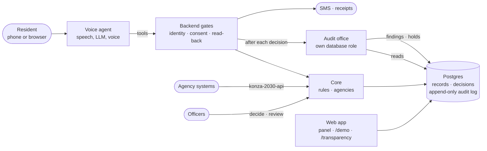
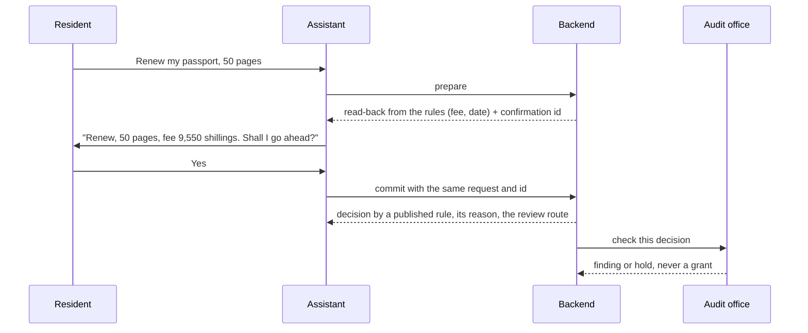

# konza-2030

A personal government assistant for every resident, by phone, in English and Swahili. It answers questions about public services, prepares and submits requests with the resident's yes, and acts for a child with a parent's consent. Published rules and human officers decide; the assistant never does. An independent audit office checks every decision.

## Architecture



Every step that spends money, submits or books is asked first:



## What it does

- **Answers** fees, eligibility and dates from the rules module, never from the model.
- **Acts on request:** applications, payments by phone code, appointments, deliveries; each read back and confirmed with a clear yes.
- **Acts for a child** only with a parent's recorded, scoped, withdrawable consent.
- **Explains every decision:** who decided (a rule or an officer), why, and how to ask for a free review.
- **Checks itself:** the audit office recomputes each decision, pauses a service when a rule looks wrong, and grades a redacted sample of calls against the assistant's charter.
- **Simulates** 500 residents through bulk harm, outages, delegation, manipulation and exclusion.

## Layout

| Path | |
|---|---|
| `agents/` | the assistant's prompt, voice and tools |
| `supabase/functions/` | backend gates (`tools`) and the audit office (`audit`) |
| `supabase/functions/_shared/konza/` | core, agencies, rules |
| `spec/konza-2030-api/` | OpenAPI 3.1 profile of Kenya's GIF v3.0 |
| `audit/` | the checker, redaction, sampled charter checks |
| `scripts/sim/` | the simulator |
| `web/` | panel, `/demo`, `/transparency`, receipts |
| `docs/konza/` | charter, world, transparency record, impact assessment |

## Run

Needs Deno 2, Node 20, Docker and the Supabase CLI; accounts on Supabase, ElevenLabs, Twilio and Vercel.

```sh
cp .env.example .env              # fill it in
supabase start                    # local stack
deno task push-agents konza       # create the voice agent
deno task demo konza              # reset and seed
```

Deploy: `supabase functions deploy tools --no-verify-jwt --use-api` and the same for `audit`; the web app with `npx vercel deploy --prod`.

## Test

```sh
deno task test                    # rules, read-backs, checker, redaction
deno task test:local              # backend gates against the local stack
deno task contract                # the API against its OpenAPI profile
deno task sim all --seed 1        # 500 synthetic residents
```

[Apache-2.0](LICENSE) · [Security](SECURITY.md) · [Threat model](THREAT_MODEL.md) · [Acceptable use](ACCEPTABLE_USE.md)

Independent open-source project. Not affiliated with the Konza Technopolis Development Authority or any government body.
